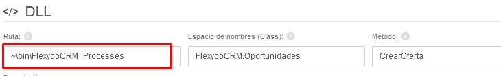
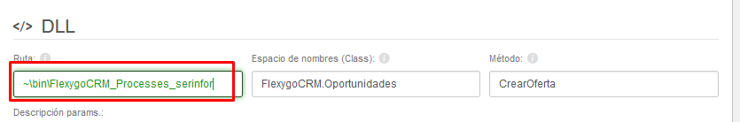
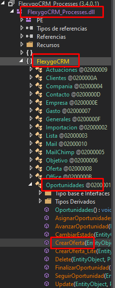
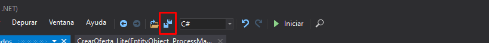

# Realizar Cambios en Procesos DLL
**DLL:** Una biblioteca de enlace dinámico o más comúnmente DLL (sigla en inglés de dynamic-link library) es el término con el que se refiere a los archivos con código ejecutable que se cargan bajo demanda de un programa por parte del sistema operativo. Esta denominación es exclusiva a los sistemas operativos Windows siendo ".dll" la extensión con la que se identifican estos ficheros, aunque el concepto existe en prácticamente todos los sistemas operativos modernos. 

Algunos de los procesos del CRM se realizan a través de archivos DLL. Al ser un archivo especial, estos no se pueden editar con un simple editor de texto. Para editarlos, antes de empezar nos tendremos que descargar un programa llamado **dnSpy** [Enlace descarga](https://github.com/dnSpy/dnSpy/releases)

A continuación nos ubicaremos en el proceso que queremos cambiar (Area de Diceño>>Gestión de Objetos>>Lógica). Estos son los pasos a seguir para cambiar un proceso:

###### 1. Copia de Proceso
Realizaremos una copia del proceso que queremos cambiar, para no alterar su funcionamiento en caso de una actualización. Para ello, una vez estemos ubicados en el proceso, pulsaremos el botón clonar.

Una vez clonado, lo nombramos y lo guardamos.

###### 2. Copia de DLL

Si es un proceso DLL estará apuntando hacia un archivo. Si queremos cambiar el código del mismo, tendremos que conseguir la ubicacion del archivo en el servidor primero.

Realizaremos una copia de este archivo DLL y lo nombraremos. Una vez hecho esto, redireccionaremos el proceso que hemos creado previamente en el CRM a este nuevo archivo.

###### 3. Editar Código DLL (dnSpy)

Ejecutaremos el programa **dnSpy**. Aqui abriremos el archivo recien creado desde la barra superior Archivo>>Abrir. Una vez el archivo se ha cargado en el programa nos dirigiremos al método que queremos editar, en este caso sería el método "CrearOferta" ubicado dentro de la clase "FlexyGoCRM.Oportunidades".

Pulsaremos click derecho encima del método que queremos editar y pulsamos en "Editar método". Se nos abrira una nueva ventana en la que podemos editar el código como queramos.

Una vez editemos el código, pulsaremos el botón "Compilar" situado abajo a la derecha. 

Para finalizar, pulsaremos el botón de "Guardar" situado en la parte superior de la aplicación.

                                                                