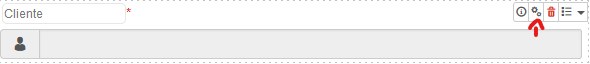
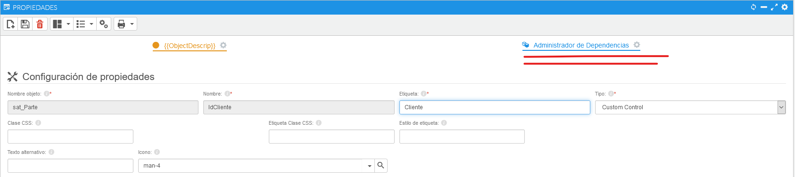
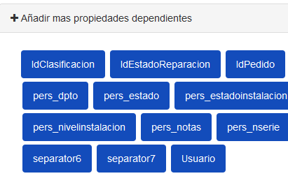

###### 1. Entrar en los ajustes de la propiedad.
Hacer click en los ajustes de la propiedad a la que quieras aplicar las dependecias.

###### 2. Entrar en el Administrador de Dependencias.
Seleccionar el Administrador de Dependencias en la parte superior a la derecha de la pantalla.

###### 3. Relacionar un desplegable con dependencias. 
+ Seleccionar la pestaña "Desplegable".

+ Seleecionar la propiedad que quieras relacionar.

+ En el campo "SQL para desplegable" vamos a introducir la query para relacionar las dos propiedades y rellenar el desplegable.

###### 4. Configurar las propiedades dependientes. 
Si queremos que las propiedades dependientes no se puedan utilizar o no se muestren cuando cargamos la página podemos hacer lo seiguiente:
+ Seleccionar la pestaña "Habilitado" e introducir la query para deshabilitar esta propiedad si devuelve algo.
+ Seleccionar la pestaña "Visible" e introducir la query para mostrar esta propiedad si devuelve algo.

