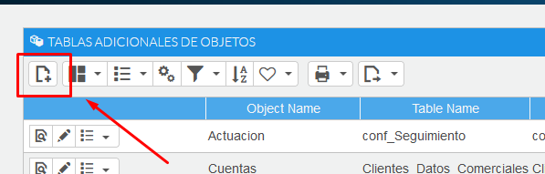
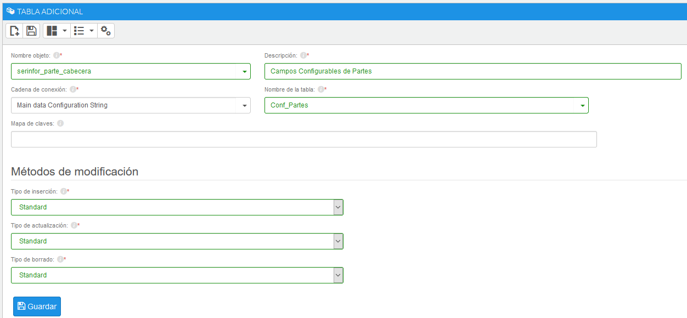

# Tablas Adicionales
Para añadir nuevos campos en el ERP AHORA, hasta ahora hemos utilizado el **AHORA Admon**, el cual creaba una nueva tabla relacionada con el prefijo "Conf" por delante (por ejemplo, Conf_Partes es la tabla con campos configurables proveniente de la tabla de Partes). 

En el **CRM** a la hora de crear un nuevo objeto, solo tenemos la opción de elegir una única tabla en principio, pero podemos utilizar las **Tablas Adicionales**.

Estas tablas sirven para incluir los campos configurables que hayamos creado en nuestro objeto. Esta tabla adicional siempre tendrá que ser la relacionada con la tabla del objeto. Una forma de saber que son las tablas relacionadas, es comprobar que ambas tienen el mismo número de registros.

Una vez tengamos claro cual es la tabla adicional que queremos relacionar en el CRM, nos dirigiremos al Área de Diseño del **Modo Desarrollo**. Una vez aquí, elegimos la opción **Tablas Adicionales** dentro del bloque **Gestión de Objetos**.

Añadir una nueva tabla adicional

###### Datos a introducir
+ **Nombre Objeto**: El nombre del objeto que ya hemos introducido en el CRM.
+ **Descripción**: Una breve descripción de la relación para el usuario.
+ **Cadena de Conexión**: Main data Configuration String.
+ **Nombre de la Tabla**: Nombre de la tabla que queremos relacionar, esta será nuestra tabla con el prefijo "Conf".
+ **Metodos de Modificación**: Tanto la inserción, la actualización y el borrado serán "**Standard**".

Debería quedar algo así:

Una vez tengamos configurados todos los campos, pulsaremos el botón **Guardar**. Si todos los cambios se han guardado correctamente, podremos añadir campos de la tabla que hemos añadido en el objeto.

