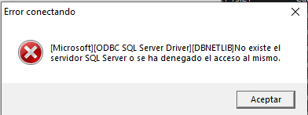
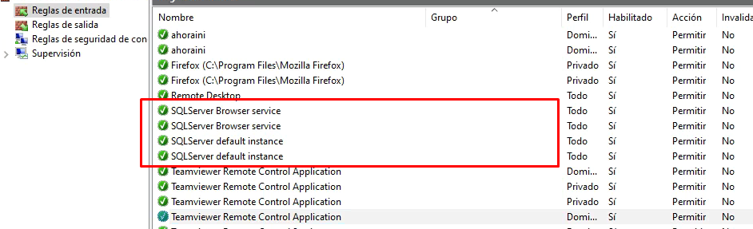
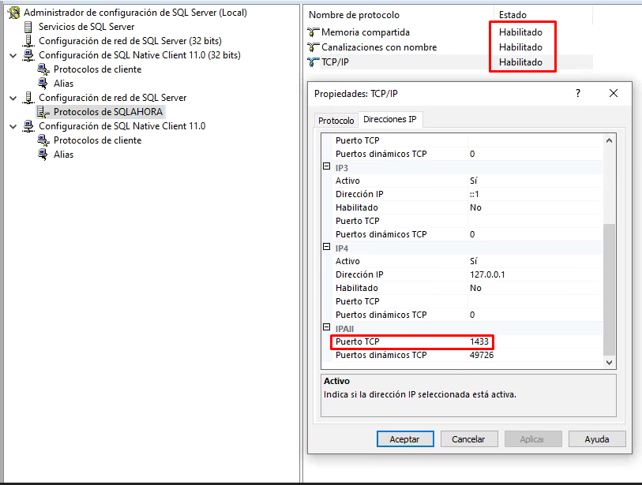
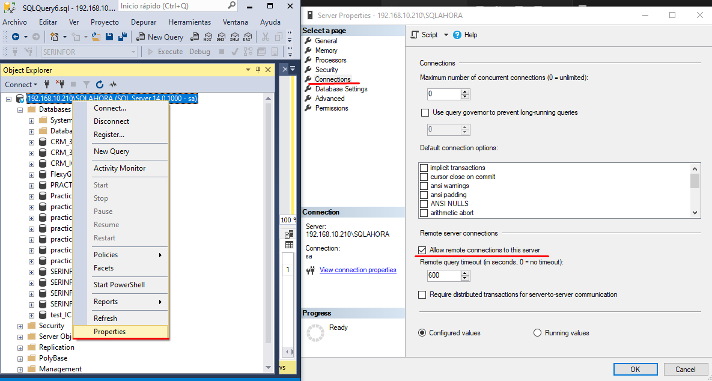

# Error de conexión cliente ERP con servidor.

###### 1. Indentificación del error.

El primer "sintoma" de este error se da cuando estamdo seguros de que estamos metiendo bien la dirección y credenciales de la instancia y da este error de conexión.



###### 2. Antes de nada.

Algo que se puede probar antes de tocar nada es a desactivar momentaniamente el firewall del servidor y volver a porbar la conexión desde el cliente, si se conecta de forma correcta ya tenemos claro que el problema es el firewall del servidor que esta cortando la comunicación.

###### 3. Nuevas reglas del firewall.

Ejecutando Powershell como administrador meteremos las siguientes lineas para permitir el la comunicación de SQL de todas sus formas (por ip, por nombre del servidor, etc.)

```powershell
# http://mattslay.com/opening-up-windows-firewall-to-allow-sql-server-to-allow-remote-connections/
# https://blog.brankovucinec.com/2015/12/04/scripts-to-open-windows-firewall-ports-for-sql-server/

Write-host Enabling SQLServer Default instance port 1433 TCP Inbound
New-NetFirewallRule -DisplayName "SQL Server TCP Port 1433" –Direction inbound -Protocol TCP –LocalPort 1433 -Action Allow

Write-host Enabling SQLServer Named Instance port 143 UDP Inbound
New-NetFirewallRule -DisplayName “SQL Server UDP Port 1434” -Direction Inbound –Protocol UDP –LocalPort 1434 -Action allow 

Write-host Enabling SQLServer EXE Application rule
New-NetFirewallRule -DisplayName “SQL Server EXE” -Direction Inbound -Program "C:\Program Files\Microsoft SQL Server\MSSQL13.SQLEXPRESS\MSSQL\Binn\sqlservr.exe" -Action allow 

Write-host Enabling SQLServer Browser Application rule
New-NetFirewallRule -DisplayName “SQL Server Browser” -Direction Inbound -Program "C:\Program Files (x86)\Microsoft SQL Server\90\Shared\sqlbrowser.exe" -Action allow 

```

###### 3.1 Nuevas reglas.



Con estas reglas habrá libre circulación por el puerto 1433 para el funcionamiento del ERP.

###### 4. Definir el puerto 1433

El siguiente paso es asegurarse desde el administrador de SQL que se esta usando el puerto **1433** y que los protocolos están habilitados. 



###### 5. Permitir las conexiones

Por último permitiremos todas las coenxiones remotas desde el servidor SQL




