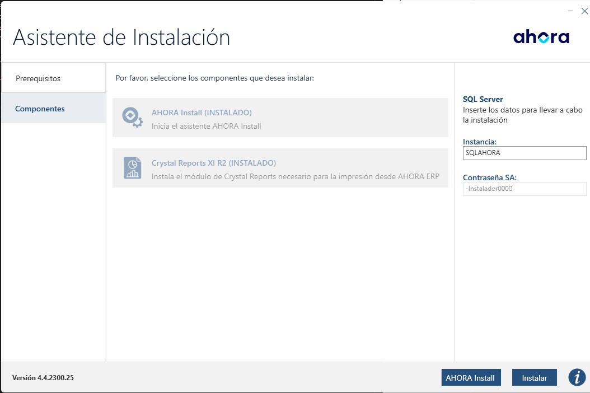

# Instalación de AhoraERP en servidor.

###### Asistente de instalación. *Presequisitos y componentes*

Lo primero que nos ofrecerá el *asistente de instalación* son los prerequisitos que y componentes que usará **AhoraERP** generalmente marcaremos las tres opciones de *prerequisitos* y las dos de *componentes* ya que son herramientas que usaremos tarde o temprano.

> En el lateral derecho del instalador veremos que la instancia que creará se llamará **SQLAHORA** y la contraseña será **-Instalador0000** (el usuario administrador siempre será *"sa"*)

###### Modulos a instalar.

Aquí podrémos elegir los modulos que necesitemos instalar.

> Si no se ha instalado un modulo necesario o el día de mañana el cliente necesita un nuevos modulos solo hay que volver a lanzar el instalador y seleccionar los modulos necesarios e instalarlos. 

